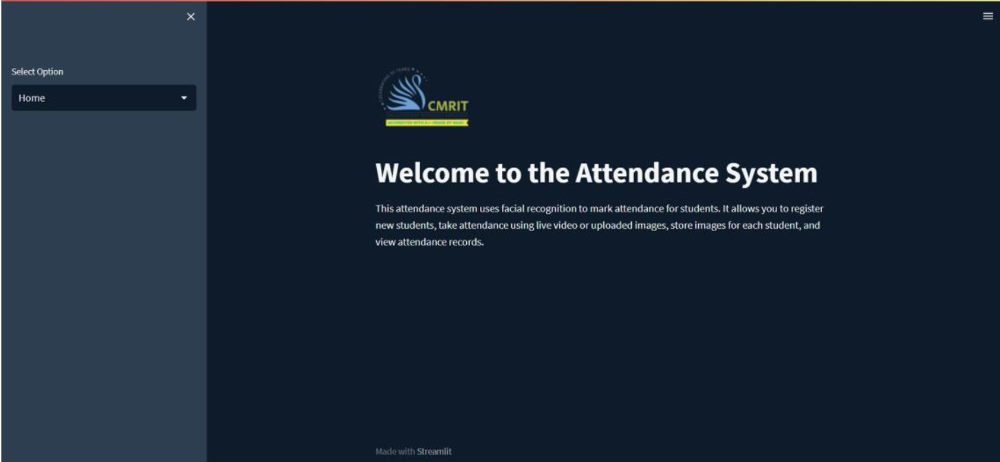
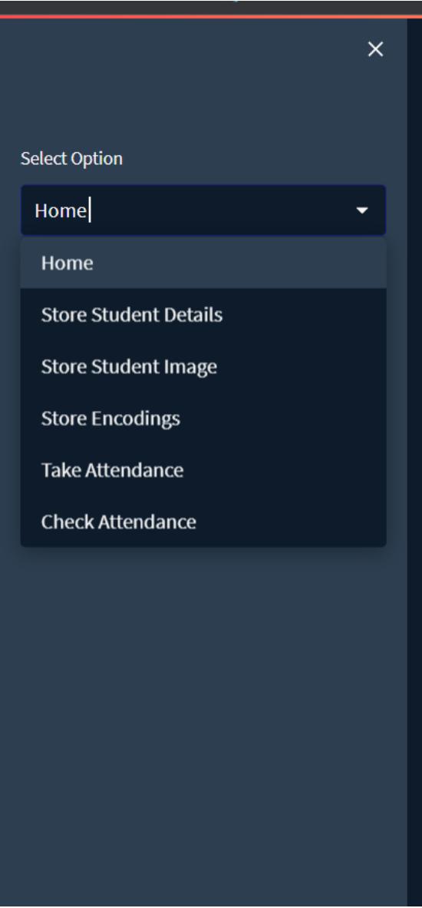
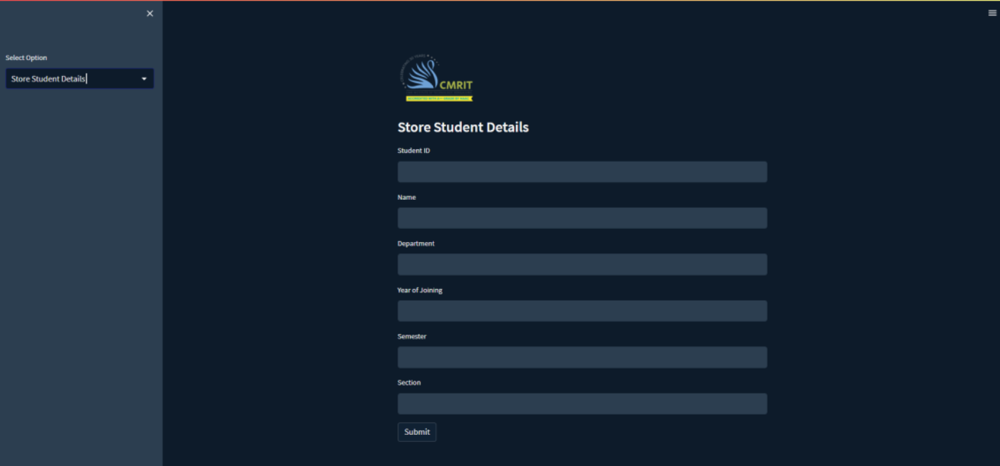
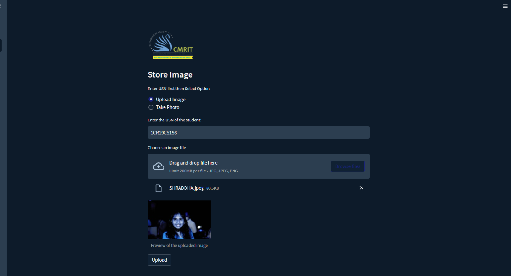
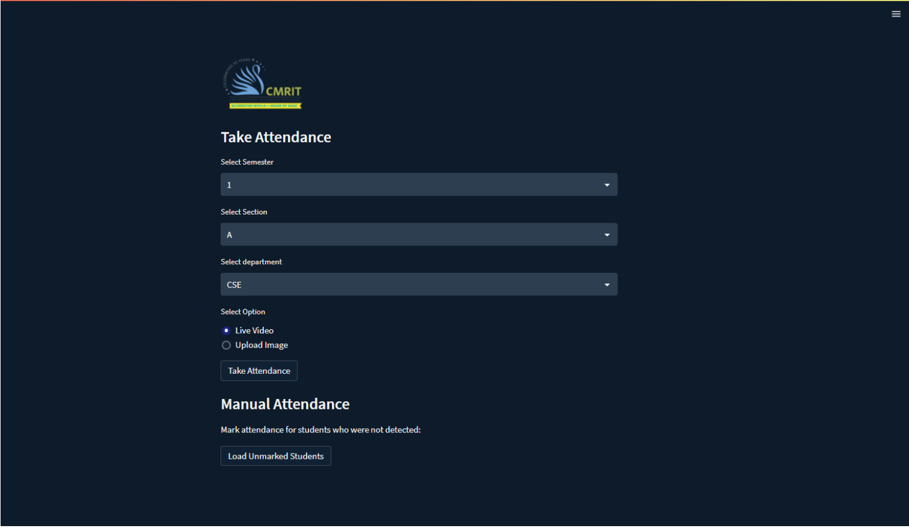
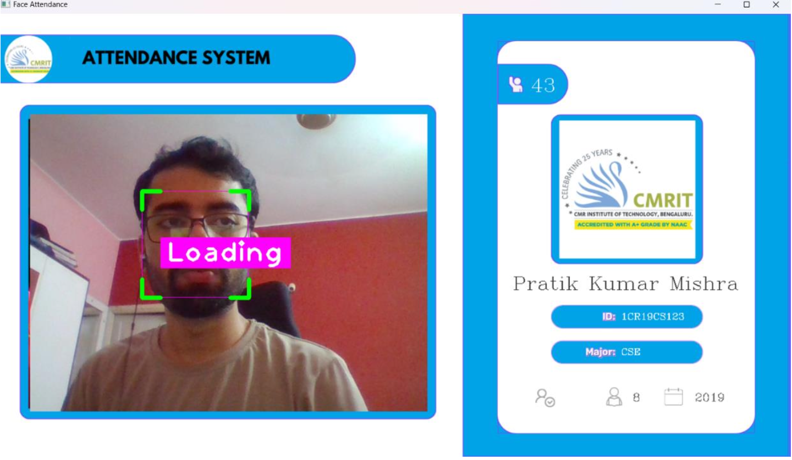

# 😎 Face Detection Project 😎

Welcome to the incredible Face Detection Project! 🎉 This cutting-edge attendance management system will blow your mind with its advanced features and seamless integration. Say goodbye to manual attendance tracking and hello to the future of automation! 🚀

## 🌟 Features that will make you go WOW! 🌟

- 🔍 Facial recognition-based attendance marking using live video feeds or uploaded images
- 🖼️ Flexible image upload options (jpg, jpeg, png) - because we know you love choices!
- ⚡ Real-time attendance tracking and updates - no more waiting around!
- ✍️ Manual attendance adjustments for those special circumstances
- 🔥 Integration with Firebase database for data storage and management - we've got your back!
- ☁️ Deployment using Microsoft Azure cloud services and Docker containerization - because we're all about that cloud life!
- 📱 Cross-platform compatibility and accessibility - use it anywhere, anytime!
- 📊 Insightful attendance reports and analytics - get ready to be amazed by the data!
- 📁 CSV export functionality for local record-keeping and analysis - because sometimes you just need a good old spreadsheet!

## 🛠️ Technologies Used (aka the secret sauce) 🛠️

- 🐍 Python - the language of the cool kids
- 👀 OpenCV - because who doesn't love computer vision?
- 🔥 Firebase - storing your data like a pro
- 🚀 Microsoft Azure - taking your project to the cloud and beyond
- 🐳 Docker - containerizing like a boss
- 🌈 Streamlit - making your app look fabulous

## 📋 Installation (aka the boring but necessary stuff) 📋

1. Clone the repository:

   ```
   git clone https://github.com/your-username/face-detection-project.git
   ```

2. Navigate to the project directory:

   ```
   cd face-detection-project
   ```

3. Create a virtual environment (optional but recommended):

   ```
   python -m venv venv
   ```

4. Activate the virtual environment:

   - For Windows:
     ```
     venv\Scripts\activate
     ```
   - For macOS and Linux:
     ```
     source venv/bin/activate
     ```

5. Install the required dependencies:

   ```
   pip install -r requirements.txt
   ```

6. Set up Firebase:

   - Create a new Firebase project in the Firebase Console
   - Enable Authentication and Realtime Database
   - Download the Firebase service account key and place it in the project directory

7. Configure Azure and Docker (if deploying to Azure):

   - Set up an Azure account and create a new resource group
   - Install Docker on your local machine
   - Build the Docker image and push it to Azure Container Registry

8. Run the application:
   ```
   streamlit run app.py
   ```

## 🚀 Usage (aka the fun part) 🚀

1. Access the application through the provided URL or localhost
2. Navigate through the different modules using the side menu
3. Store student details by filling in the required information and submitting the form
4. Store student images by uploading an image or capturing it through the webcam
5. Generate and store facial encodings for the registered students
6. Take attendance using live video or by uploading an image
7. View and download attendance reports and analytics

## 📸 Screenshots (because a picture is worth a thousand words) 📸













## 🤝 Contributing (aka joining the cool club) 🤝

Want to be a part of the cool club? Contributions are welcome! If you find any issues or have suggestions for improvement, please create an issue or submit a pull request. Let's make this project even more awesome together! 💪

## 📞 Contact (aka how to reach the mastermind) 📞

If you have any questions, feedback, or just want to say hi, feel free to reach out to the project mastermind:

- 🙋‍♂️ Name: Pratik Kumar Mishra
- 📧 Email: pratikmishra79@gmail.com
- 🐙 GitHub: [your-github-username](https://github.com/Pratik228)

Get ready to revolutionize attendance management with the Face Detection Project! 🎉🚀
