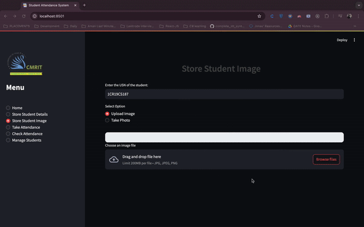

# 😎 Face Detection Attendance System: The Future of Classroom Management 🚀

Tired of wasting precious lecture time calling out names? Say goodbye to outdated attendance methods! Our cutting-edge Face Detection Attendance System revolutionizes classroom management, giving you back those valuable minutes for what really matters - teaching!

## 🎥 See It In Action!



## 🌟 Why Choose Our System?

- ⏱️ Save 5-10 minutes per lecture
- 🎯 Increase accuracy and eliminate human error
- 📊 Get real-time insights into student attendance patterns
- 🔒 Enhance security with biometric verification
- 🖥️ Seamlessly integrate with your existing LMS

## 🔥 Standout Features

- 🔍 Lightning-fast facial recognition for instant attendance marking
- 🎥 Dual-mode operation: Live video feed or bulk image upload
- 👥 Multi-face detection for group attendance
- ⚡ Real-time syncing with cloud database
- ✍️ Manual override for attendance adjustments
- 📊 Comprehensive analytics and reporting
- 📁 One-click CSV export for easy record-keeping

## 🛠️ Cutting-Edge Tech Stack

- 🐍 Python: The backbone of our robust system
- 👁️ OpenCV & dlib: State-of-the-art computer vision libraries
- 🔥 Firebase: Scalable, real-time cloud database
- 🚀 Streamlit: Sleek, responsive user interface

## 🚀 Quick Start Guide

1. Clone the repository:

   ```
   git clone https://github.com/Pratik228/FDP.git
   cd FDP
   ```

2. Set up your virtual environment:

   ```
   python -m venv venv
   source venv/bin/activate  # On Windows, use `venv\Scripts\activate`
   ```

3. Install dependencies:

   ```
   pip install -r requirements.txt
   ```

4. Configure Firebase:

   - Create a Firebase project
   - Enable Authentication and Realtime Database
   - Download your service account key
   - Add to `.env`:
     ```
     FIREBASE_SERVICE_ACCOUNT_KEY_PATH=path/to/your/serviceAccountKey.json
     ```

5. Launch the application:
   ```
   streamlit run attendance.py
   ```

## 💡 Innovative Features in Action

1. **Bulk Student Registration**: Upload multiple student images at once for quick setup
2. **Smart Attendance Marking**: Automatically detect and mark attendance for multiple students in a single frame
3. **Flexible Input Options**: Use live video feed for real-time marking or upload images for batch processing
4. **Intelligent Reporting**: Get insights on attendance trends, frequent absentees, and more
5. **User-Friendly Interface**: Intuitive design for easy navigation and operation

## 🤝 Join Our Innovation Journey

We welcome contributions! Feel free to submit a Pull Request and be part of the future of attendance systems.

## 📞 Get In Touch

Have questions or feedback? We'd love to hear from you!

- 👨‍💻 Pratik Kumar Mishra
- 📧 pratikmishra79@gmail.com
- 🐙 GitHub: [Pratik228](https://github.com/Pratik228)

Ready to transform your classroom management? Let's revolutionize attendance together! 🎉🚀
